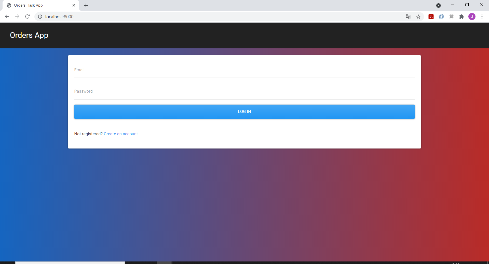
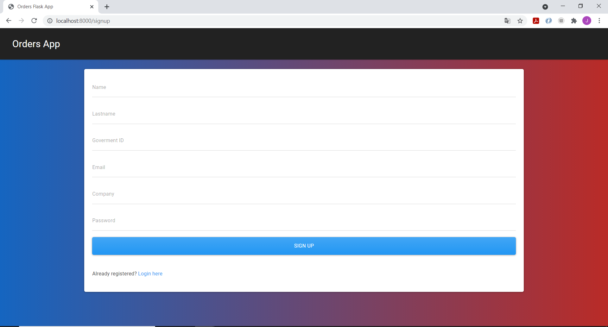

# Orders app
Orders app is an application where you can find the information of an order made by a user. <br>
The project have a database in mysql with some users, orders, shipping and payment tables. <br>
The idea is to register in the page, once registered you can login. <br>
After login you will be in the home page where you can search for an order according some specific characteristics.

## Login and Signup <br>



<br>

## Home, users and orders information<br>


<br>

### POST Endpoints
- api/v1/signup Create a user
- api/v1/login Get an api key

### GET Endpoints
- api/v1/users/all Get all users and the respective information
- api/v1/orders/:orderId Get the details of an order based on its id
- api/v1/:orderId,:orderId,:orderId Get the detail of all the orders based on the id separated by comma.
- api/v1//orders/userid/:Uid Get the order(s) information according to the userId

## Technologies
- Ubuntu 18.04
- Python 3.6.9
- Flask 2.0.1
- Werkzeug 2.0.1
- mysql  Ver 14.14 Distrib 5.7.34, for Linux (x86_64)

## How to use:
1. Clone this repository
```bash
git clone https://github.com/jorgechauxjr/hbtn_col_assestment_test.git
```
2.  change to hbtn_col_assestment_test directory
```bash
cd hbtn_col_assestment_test/
```
3. Create the database with the info. 
For that you need to execute the company.sql that is inside the db directory
```bash
cd db/
cat company.sql | sudo mysql -u root
```
4. Open a new temrinal to run the backend api: in charge of receiving request
```bash
cd hbtn_col_assestment_test/
python3 api/v1/app.py
```
The server for the backend is ready to receive requests

5. Open a new terminal to run the frontend app. 
```bash
cd hbtn_col_assestment_test/
python3 frontend/app.py
```
Ready! 
You can open your browser in http://localhost:8000 to use the app

- When you open http://localhost:8000 the browser will open in the login page. You can login with any of this sample users:

| Email  | Password |
| ------------- | ------------- |
| betty@email.com| 123 |
| steve@email.com | 123 |

Or if you prefer you can go to the Signup page to register with your own user information

### Authors
* Jorge Chaux Jr | [GitHub](https://github.com/jorgechauxjr) |

### Creator of the hbtn assessment test
* Carlos Cárdenas | [GitHub](https://github.com/carcagi) |
